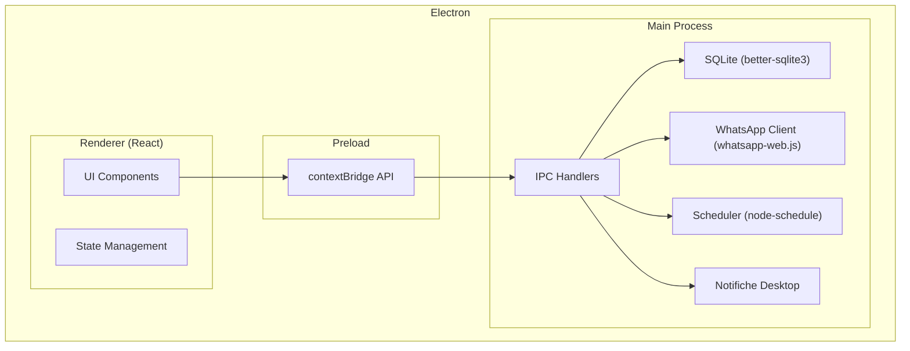
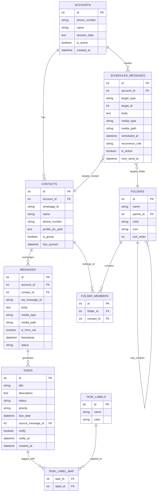

# MICH-ENGER — Client Desktop WhatsApp (Slack-like)

App desktop Electron per gestire contatti WhatsApp con interfaccia simile a Slack, messaggi programmati, sistema task/to-do e supporto multi-account.

## User Review Required

> [!IMPORTANT]
> **Framework UI**: Per un'app di questa complessità (tree view, chat, drag & drop, task board), propongo di usare **React** nel renderer Electron. Vanilla JS sarebbe estremamente difficile da mantenere. Sei d'accordo?

> [!WARNING]
> **whatsapp-web.js**: Questa libreria non è ufficiale. WhatsApp potrebbe bannare temporaneamente account che la usano in modo aggressivo. Consiglio di limitare la frequenza di invio e di non inviare a troppi contatti contemporaneamente.

> [!IMPORTANT]
> **Sviluppo a fasi**: Questo è un progetto molto grande. Propongo di svilupparlo in **4 fasi incrementali**, ognuna testabile e funzionante. Approvi questo approccio?

## Open Questions

> [!IMPORTANT]
> 1. **Nome dell'app**: "MICH-ENGER" va bene come nome definitivo?
> 2. **Icona app**: Hai un logo/icona o ne genero uno io?
> 3. **Media scaricati**: Dove preferisci salvare i media (immagini, video, documenti) scaricati da WhatsApp? Nella cartella dell'app o in una cartella personalizzabile?

---

## Architettura Generale



### Stack Tecnologico

| Componente | Tecnologia |
|---|---|
| Desktop Shell | Electron 33+ |
| UI Framework | React 19 + Vite |
| Database | better-sqlite3 (WAL mode) |
| WhatsApp | whatsapp-web.js |
| Scheduling | node-schedule |
| Notifiche | Electron Notification API |
| Icone | Lucide React |
| Tema | CSS Custom Properties |

---

## Schema Database



---

## Layout UI

```
┌──────────────────────────────────────────────────────────┐
│  Menu Bar                                                │
├────┬───────────────┬─────────────────────────────────────┤
│ AC │  SIDEBAR      │  MAIN AREA                         │
│ CO │               │                                     │
│ UN │ 🔍 Ricerca    │  [Header: nome contatto/cartella]  │
│ T  │               │                                     │
│    │ 📁 Cartelle   │  ┌─────────────────────────────┐   │
│ S  │  ├─ Lavoro    │  │  Chat / Task View           │   │
│ W  │  │  ├─ Team   │  │                             │   │
│ I  │  │  └─ VIP    │  │  Messaggi con bolle         │   │
│ T  │  └─ Personale │  │  stile chat                 │   │
│ C  │               │  │                             │   │
│ H  │ 👤 Contatti   │  └─────────────────────────────┘   │
│ E  │ 👥 Gruppi     │                                     │
│ R  │               │  [Input: scrivi messaggio...]      │
│    │ ✅ Tasks      │  [📎 📷 🎤 ⏰ Programma]          │
│    │ ⏰ Programmati│                                     │
├────┴───────────────┴─────────────────────────────────────┤
│  Status: Connesso ● | Account: +39 xxx | Tema: 🌙      │
└──────────────────────────────────────────────────────────┘
```

---

## Proposed Changes — Sviluppo in 4 Fasi

### Fase 1 — Fondamenta (Shell + DB + UI Base + Tema)

Setup del progetto Electron + React, database SQLite, sistema di temi, layout Slack-like con sidebar e area principale.

#### [NEW] package.json
- Dipendenze: electron, react, vite, better-sqlite3, lucide-react
- Script: dev, build, package

#### [NEW] src/main/main.js
- Entry point Electron, crea BrowserWindow
- Configura `contextIsolation: true`, `nodeIntegration: false`
- Inizializza database in `app.getPath('userData')`

#### [NEW] src/main/database.js
- Connessione SQLite con WAL mode
- Creazione tabelle (tutte quelle nello schema)
- Funzioni CRUD per ogni entità

#### [NEW] src/main/ipc-handlers.js
- Registra tutti gli handler IPC (accounts, contacts, folders, messages, tasks, scheduled)

#### [NEW] src/preload/preload.js
- contextBridge con API sicure per il renderer

#### [NEW] src/renderer/App.jsx
- Layout principale con sidebar + main area
- Router per le diverse viste (chat, tasks, programmati)

#### [NEW] src/renderer/index.css
- Design system completo con CSS custom properties
- Tema chiaro e scuro
- Stile Slack-like: sidebar scura, area principale chiara/scura

#### [NEW] src/renderer/components/Sidebar.jsx
- Account switcher (colonna sinistra stretta)
- Albero cartelle con nesting illimitato (espandibile/collassabile)
- Sezioni: Cartelle, Contatti, Gruppi, Tasks, Programmati
- Ricerca globale

#### [NEW] src/renderer/components/FolderTree.jsx
- Componente ricorsivo per cartelle/sub-cartelle
- CRUD cartelle inline (rinomina, elimina, crea sub-cartella)
- Drag & drop per riordinare e nidificare

#### [NEW] src/renderer/components/ThemeToggle.jsx
- Switch tema chiaro/scuro, salvataggio preferenza in localStorage

---

### Fase 2 — WhatsApp Connection + Chat

Integrazione whatsapp-web.js, scansione QR, sincronizzazione contatti/messaggi, vista chat completa.

#### [NEW] src/main/whatsapp-manager.js
- Gestione multipla istanze whatsapp-web.js (una per account)
- Generazione QR code e invio al renderer via IPC
- Gestione eventi: ready, message, disconnected
- Sincronizzazione contatti e gruppi al primo avvio
- Download media (immagini, video, audio, documenti)

#### [NEW] src/renderer/components/QRCodeModal.jsx
- Modal per scansionare QR code di WhatsApp
- Stato: in attesa, scansione, connesso, errore

#### [NEW] src/renderer/components/ChatView.jsx
- Vista chat simile a WhatsApp/Slack
- Bolle messaggi con timestamp, stato (inviato/consegnato/letto)
- Supporto media: immagini inline, video player, audio player, download documenti
- Input messaggio con emoji, allegati, registrazione audio
- Scroll infinito per storico messaggi

#### [NEW] src/renderer/components/ContactList.jsx
- Lista contatti sincronizzati con foto profilo
- Lista gruppi
- Badge messaggi non letti

#### [NEW] src/renderer/components/AccountSwitcher.jsx
- Colonna stretta a sinistra con avatar account
- Bottone "+" per aggiungere nuovo account
- Indicatore account attivo e stato connessione

---

### Fase 3 — Messaggi Programmati + Cartelle avanzate

Sistema completo di messaggi programmati con ricorrenze e gestione avanzata cartelle.

#### [NEW] src/renderer/components/ScheduleMessageModal.jsx
- Selezione data/ora per invio singolo
- Configurazione ricorrenze (giornaliero, settimanale, mensile, personalizzato)
- Selezione destinatari: singolo contatto, cartella, sub-cartella, gruppo
- Anteprima messaggio prima di confermare
- Supporto allegati

#### [NEW] src/main/scheduler.js
- Motore di scheduling con node-schedule
- Controlla messaggi programmati al boot e ogni minuto
- Esegue invio tramite whatsapp-manager
- Gestisce ricorrenze (calcola prossimo invio)
- Log invii riusciti/falliti

#### [NEW] src/renderer/components/ScheduledList.jsx
- Lista messaggi programmati con stato, prossimo invio, ricorrenza
- Azioni: modifica, pausa, elimina, invia ora

#### [MODIFY] src/renderer/components/FolderTree.jsx
- Menu contestuale: assegna contatti, crea sub-cartella, rinomina, elimina
- Modal per assegnare contatti multipli a cartella
- Conteggio contatti per cartella

#### [NEW] src/renderer/components/FolderContactManager.jsx
- Interfaccia per aggiungere/rimuovere contatti da cartelle
- Ricerca contatti
- Vista contatti che appartengono a più cartelle

---

### Fase 4 — Task/To-Do + Notifiche + Polish

Sistema task completo, notifiche desktop, ricerca globale, rifinitura UX.

#### [NEW] src/renderer/components/TaskView.jsx
- Board con colonne per stato: Da fare → In corso → Completato → Archiviato
- Card task con titolo, priorità (colore), scadenza, etichette
- Drag & drop tra colonne per cambiare stato
- Filtri per priorità, etichetta, scadenza

#### [NEW] src/renderer/components/TaskDetailModal.jsx
- Modifica titolo, descrizione, stato, priorità, scadenza
- Gestione etichette (crea, assegna, rimuovi con colori)
- Toggle notifica con selezione data/ora promemoria
- Link al messaggio originale (se creato da messaggio)

#### [NEW] src/renderer/components/MessageToTask.jsx
- Bottone su ogni bolla messaggio "Aggiungi a Task"
- Quick-create task dal messaggio con titolo precompilato
- Collegamento bidirezionale messaggio ↔ task

#### [NEW] src/main/notification-manager.js
- Notifiche desktop per task in scadenza
- Notifiche per messaggi programmati in partenza
- Rispetto delle preferenze utente (notifica sì/no per ogni task)

#### [NEW] src/renderer/components/SearchOverlay.jsx
- Ricerca globale (Ctrl+K): contatti, messaggi, task, cartelle
- Risultati raggruppati per tipo
- Navigazione rapida ai risultati

#### Polish finale
- Animazioni e transizioni fluide
- Gestione errori e stati di loading
- Micro-interazioni (hover, click feedback)
- Responsive: ridimensionamento finestra gestito

---

## Struttura File Completa

```
MICH-ENGER/
├── package.json
├── vite.config.js
├── electron-builder.yml
├── src/
│   ├── main/
│   │   ├── main.js                    # Entry Electron
│   │   ├── database.js                # SQLite setup + CRUD
│   │   ├── ipc-handlers.js            # IPC bridge
│   │   ├── whatsapp-manager.js        # Multi-account WhatsApp
│   │   ├── scheduler.js               # Messaggi programmati
│   │   └── notification-manager.js    # Notifiche desktop
│   ├── preload/
│   │   └── preload.js                 # contextBridge
│   └── renderer/
│       ├── index.html
│       ├── index.jsx                  # React entry
│       ├── index.css                  # Design system + temi
│       ├── App.jsx                    # Layout + routing
│       └── components/
│           ├── Sidebar.jsx
│           ├── FolderTree.jsx
│           ├── AccountSwitcher.jsx
│           ├── ThemeToggle.jsx
│           ├── ChatView.jsx
│           ├── ContactList.jsx
│           ├── QRCodeModal.jsx
│           ├── ScheduleMessageModal.jsx
│           ├── ScheduledList.jsx
│           ├── FolderContactManager.jsx
│           ├── TaskView.jsx
│           ├── TaskDetailModal.jsx
│           ├── MessageToTask.jsx
│           └── SearchOverlay.jsx
├── assets/
│   └── icons/
└── media/                             # Media WhatsApp scaricati
```

---

## Verification Plan

### Automated Tests
- Test unitari per database.js (CRUD tutte le tabelle)
- Test per scheduler.js (calcolo prossimo invio, ricorrenze)
- Avvio app Electron e verifica rendering UI

### Manual Verification
- Scansione QR code e connessione WhatsApp
- Invio/ricezione messaggi in tempo reale
- Creazione cartelle nidificate e assegnazione contatti
- Programmazione messaggi con ricorrenze
- Creazione task da messaggio e gestione board
- Switch tema chiaro/scuro
- Test multi-account
- Notifiche desktop
